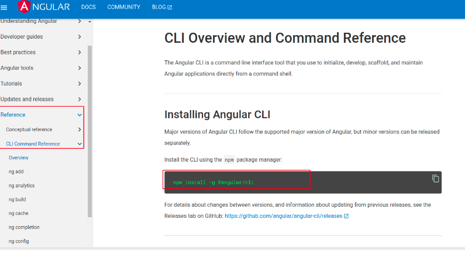

# Estrutura do básico ao avançado somente sobre javascript puro.

<a href="https://developer.mozilla.org/en-US/docs/Web/JavaScript" title="JavaScript"></a>

- Todas as etapas são feitas e documentadas através de commits
- Todo novo modulo (etapa) é dividida através de uma nova branch

- Para iniciamos com angular precisamos do node instalado: https://nodejs.org/en  


- Trabalha com leasy load, importante para carregamento de arquivos pesados 

- Podemos criar vários módulos 

- Site do framework: https://angular.io/  

- Nova documentação: https://angular.dev/  

- Github do curso: https://github.com/troquatte/curso-angular-latest  

- Instruções do curso: https://vidafullstack.com.br/instrucoes-para-o-curso/  

- Projeto aula javascript: https://github.com/troquatte/curso-javascript  

- Plataforma para build de softwares angular para multiplataformas: https://docs.nativescript.org/  

* verificar versao node.js
    ```sh
    node -v
    ```
* verificar versao npm
    ```sh
    npm -v
    ``` 

* Instalando o visionado de NODE.JS: https://www.npmjs.com/package/n  

* Gerenciando Versões do Node.js com o N:  https://www.dio.me/articles/gerenciando-versoes-do-nodejs-com-o-n  

* Instalando o angular CLI: https://angular.io/cli 

    
 
* verificar versao angular
    ```sh
    ng --version
    ```

* verificar help ng
    ```sh
    ng help
    ```    

* rodar arquivo.js com node
    ```sh
    node arquivo.js
    ```

1. Install NPM packages
   ```sh
   npm install
   ```
2. Percorendo uma lista `lista.js`
   ```js
   var lista = [1, 2, 3, 4, 5, 6, 7, 8, 9, 10];

    lista.forEach(function (valor, indice) {
    console.log("iten: "+ indice, "valor: " , valor);
    });
   ```
